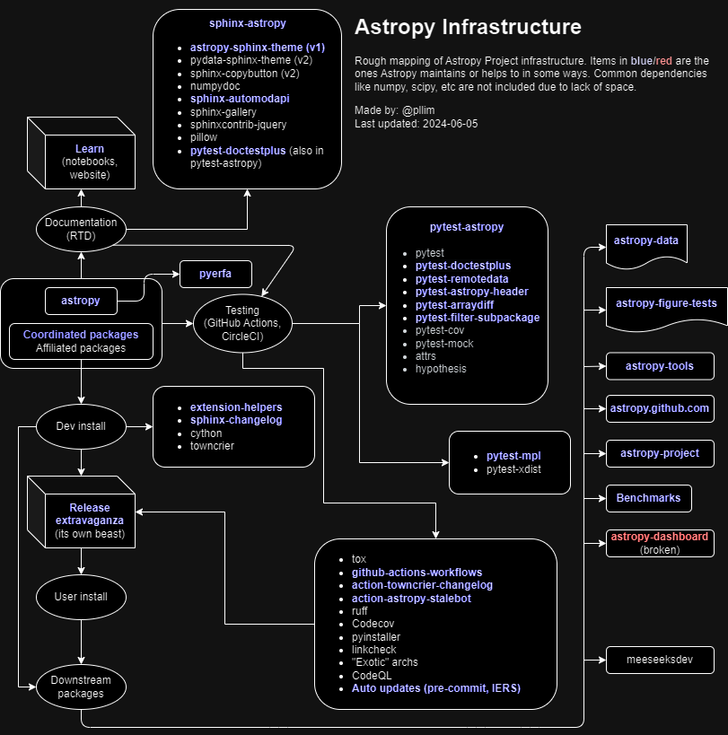

# What is DevOps?

According to [Atlassian's DevOps page](https://www.atlassian.com/devops):

*DevOps is a set of practices, tools, and a cultural philosophy that
automate and integrate the processes between software development and IT teams.
It emphasizes team empowerment, cross-team communication and collaboration,
and technology automation.*

## Okay, but what does it really mean?

We use (mostly free) tools and automated process to do the job of multiple
people to ensure what is in dev is fit for ops. This is where a good test suite,
continuous integration (CI), and automated workflows become essential.

In Astropy, since the project is hosted on GitHub, it uses mostly
[GitHub Actions](https://github.com/features/actions).

## Did you say free?

If your code is open source (i.e., publicly viewable), GitHub provides
free usage of GitHub Actions. While it comes with quota, that should
not be a problem for most repositories. For more info, see
[GitHub pricing](https://github.com/pricing).

## Did you say mostly?

If you have private code (e.g., sensitive observatory controls), you probably want
[self-hosted runners](https://docs.github.com/en/actions/hosting-your-own-runners/managing-self-hosted-runners/about-self-hosted-runners). While those can still
fall within GitHub's free-tier usage, you have to pay the cost of maintaining
your own hardware and runners. In practice, if you need this, your usage would
exceed the free-tier limit, so you will likely have to pay for a
GitHub Actions plan anyway.

If you have needs for uncommon architectures or large runners, you will likely
also have to pay. For more info, see
[billing for GitHub Actions](https://docs.github.com/en/billing/managing-billing-for-your-products/managing-billing-for-github-actions/about-billing-for-github-actions).

You may set a spending limit (recommended) but you do have to give them
a credit card first.

## Do I have other choices besides GitHub?

Of course, but all of them come with similar limitations. Other services
that Astropy also uses:

* [CircleCI](https://circleci.com/) for image tests for `astropy.visualization`
  because of its support for artifacts for humans to vet image comparisons.
* [Azure Pipelines](https://azure.microsoft.com/en-us/products/devops/pipelines)
  that has the same owner as GitHub Actions (Microsoft). It is probably
  more powerful but harder to use.

Other services out there (list not exhaustive):

* [GitLab CI](https://docs.gitlab.com/ee/ci/) for CI support like GitHub Actions
  but for code hosted on GitLab.
* [Jenkins](https://www.jenkins.io/) that is useful if you have a lot of
  internal stuff and have the expertise to understand/maintain this framework.
  This is not really recommended for small project with limited resources.

Complementary services/tools that are useful but have limited scope
(list not exhaustive):

* [ReadTheDocs](https://about.readthedocs.com/) for online documentation building, hosting, and
  [pull request previews](https://docs.readthedocs.io/en/stable/pull-requests.html).
* [pre-commit.ci](https://pre-commit.ci/) for style checks if you use
  [pre-commit](https://pre-commit.com/).
* [Codecov](https://about.codecov.io/) for code coverage reporting.
* [Hypothesis](https://hypothesis.readthedocs.io/en/latest/) for testing against
  edge cases, especially in low-level library code.

## How do I decide what to use?

Software is a fast-moving domain. The services mentioned above (or any you
come across in the wild) can change overnight. This is a risk you must
accept when picking a service that you do not have complete control over.
Case studies:

* [Travis CI was acquired by Idera](https://techcrunch.com/2019/01/23/idera-acquires-travis-ci/)
  and started to monetize even the open source projects. Astropy had to
  scramble to move its reliance to GitHub Actions. Some others chose to pay.
* [Anaconda looking to monetize even non-profit institutional usage](https://www.theregister.com/2024/08/08/anaconda_puts_the_squeeze_on/)
  causing some projects including Astropy to move away to alternatives like
  [miniforge](https://github.com/conda-forge/miniforge).
  (This situation is still ongoing at the time of writing.)

With this in mind, make a list of "must, must not, and nice to have" features
and discuss with your team which tools best fit your needs. There is no
one right answer.

# What does DevOps look like in Astropy?

# Why are tests important?

CI does not work without a meaningful test suite or workflows.
The building blocks are unit tests. Depending on your needs,
you might also need an expanded test suite, e.g., system or integration tests.

Test matrix could help in determining that your code works in
different enviroments that you support; e.g., OSes, Python versions,
and upstream releases (or unreleased copies).

CI also does not work if no one checks its status. Once deployed,
maintainers should make sure they receive notifications and
be committed to fix failures in a timely manner to avoid
technical debt piling up.

Astropy uses [pytest](https://docs.pytest.org/en/stable/) and
[relevant plugins](https://github.com/astropy/pytest-astropy)
to run its test suites. It also utilizes [tox](https://tox.wiki/en/stable/)
to ensure the tests are run in an isolated environment.

## What about the data?

Some packages, especially related to image processing or pipeline,
require a lot of test data to have meaningful tests. Free-tier services
are insufficient for this need as they cap the storage or download
limits. Therefore, even if you are able to host the data elsewhere,
it would be a challenge to download them all into your CI run.
Furthermore, if your data is hosted on a server, chances are the
server would eventually block the CI service as "spammer" unless
you have a way to allow the IP addresses.

Data hosting services include but not limited to
[Git LFS](https://git-lfs.com/) and
[Artifactory](https://jfrog.com/artifactory/), which have additional
cost overhead for any meaningful usage.

One possible workaround is to design your code to be testable on
a smaller set of data that could be packaged with the code as test data
or fit within the free-tier limit of the services mentioned above.
However, this option might not always be feasible.

Ultimately, if your test suite relies on "big data," you must factor
in the cost of using them for testing in your development workflow.

## What about the performance?

Performance usually relates to either timing or memory. There are tools
out there for these as well, but they will not be covered by this document.
For timing, `astropy` does have benchmark tests; see its
[ci_benchmark.yml](https://github.com/astropy/astropy/blob/main/.github/workflows/ci_benchmark.yml).

Test suites for performance are usually very different from regular CI
because they either require a lot of memory or time to run. After all,
these are a form of stress testing. Therefore, it is recommended that you
run these only as needed or in a set schedule outside of regular CI.

# What can you do to improve your package/pipeline?

If all this information is overwhelming to you, that is totally alright.
After all, Rome was not built in a day. You could start small and work
your way up to your final DevOps goal eventually.

Some preliminary steps you could take as a package maintainer:

* Build a basic test suite to test the most important aspects of your software.
* Build a basic test matrix to test the most commonly used environment combos.
* If you use `astropy`, you could start testing against its nightly dev wheel via
  `python -m pip install --upgrade --extra-index-url https://pypi.anaconda.org/astropy/simple astropy --pre` (also available there at the time of writing:
  `photutils`, `reproject`, and `astropy-healpix`).
* If you accept pull requests (or merge requests as GitLab calls it),
  enable CI for any submitted pull request to ensure new code does not
  break existing code *before* it is merged.

Some steps you could take in management role:

* Recognize that DevOps is an essential part in your software lifecycle
  and allow your developers to spend time on it without penalizing
  their professional growth.
* Encourage developers to develop DevOps skills and train others as well.
* Set aside time (hence, money) for developing tests and necessary infrastructure.

After all, such practices could help reduce technical debt and hence
reduce cost of future maintenance. Having such tools also would reduce
the risk of "single point of failures" in your projects.
You would win in the long game. Huzzah!
